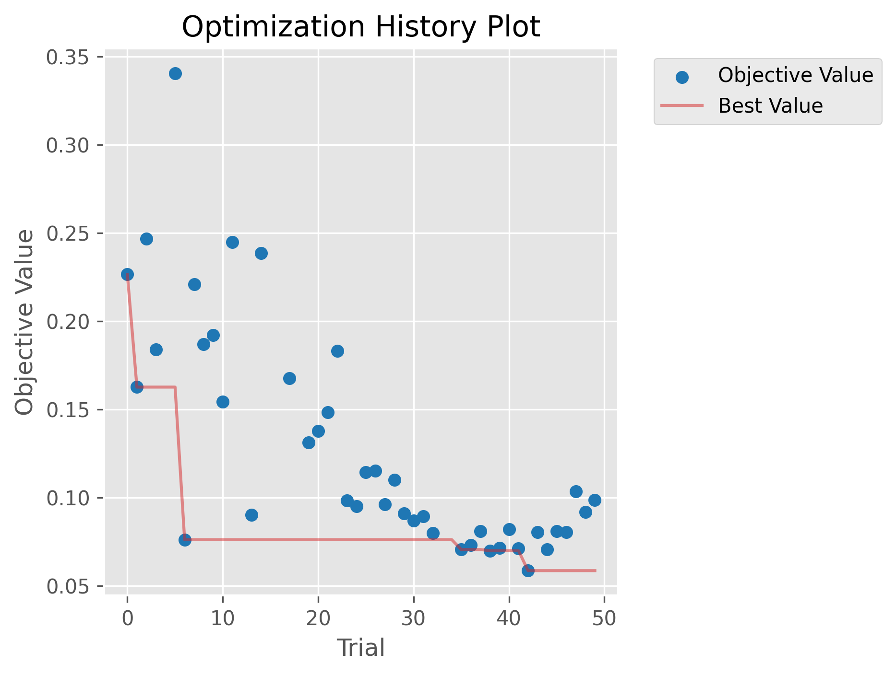
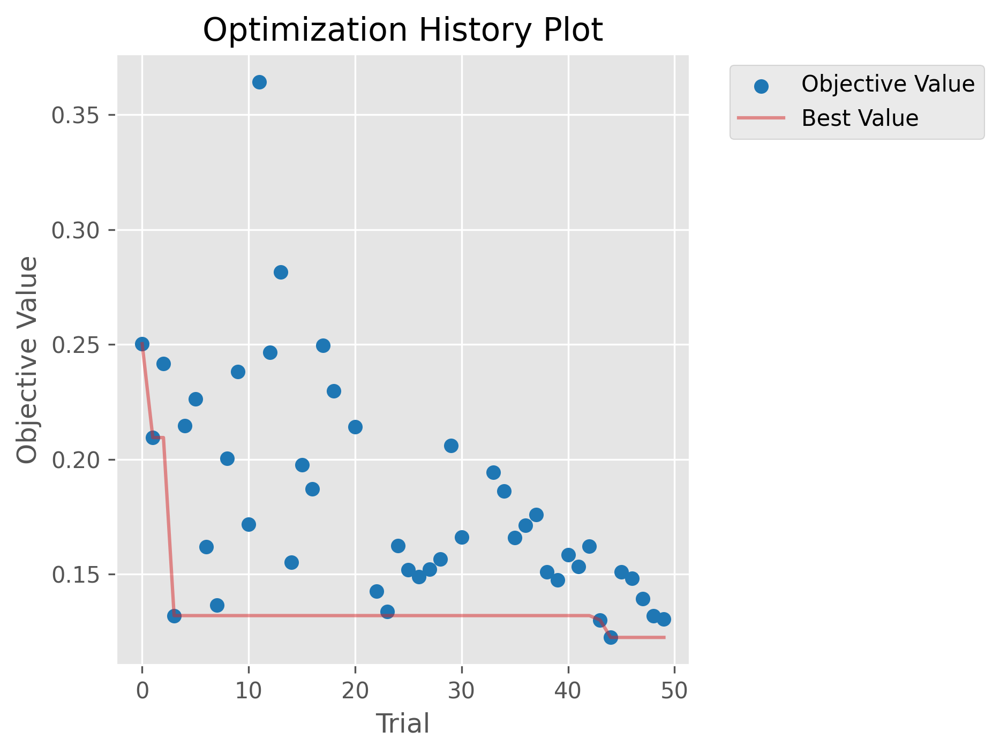
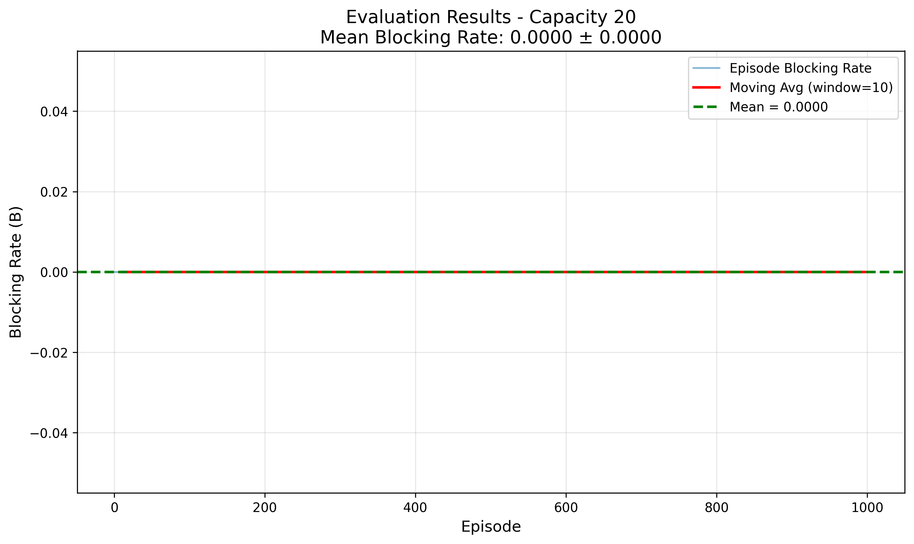

# Routing and Spectrum Allocation (RSA) using Deep Q-Network

This project implements a Deep Q-Network (DQN) agent to solve the Routing and Spectrum Allocation (RSA) problem in optical communication networks. The goal is to minimize request blocking by intelligently selecting paths and allocating wavelengths.

## Table of Contents
- [How to Execute](#how-to-execute)
- [Environment](#environment)
- [State Representation and State Transitions](#state-representation-and-state-transitions)
- [Action Representation](#action-representation)
- [Reward Function](#reward-function)
- [Training Setup](#training-setup)
- [Results](#results)

---

## How to Execute

### Prerequisites

Install required dependencies:

```bash
pip install gymnasium networkx numpy pandas matplotlib stable-baselines3 torch rich tqdm tensorboard
```

### Training

To train DQN agents for both capacity configurations:

```bash
python dqn_runner.py
```

This will:
- Train a DQN agent with link capacity = 20
- Train a DQN agent with link capacity = 10
- Save models to `models/` directory
- Generate training plots in `plots/` directory
- Save training metrics as JSON files

Training typically takes 30-60 minutes depending on hardware and number of episodes.

**Note**: By default, the script uses Optuna-optimized hyperparameters. To use standard hyperparameters, set `use_optimized = False` in the `main()` function.

### Hyperparameter Optimization (Optional)

To run Optuna hyperparameter tuning:

```bash
python dqn_optuna_tuning.py
```

This will:
- Perform Bayesian optimization with 100 trials per capacity
- Use MedianPruner for early stopping of poor trials
- Save best hyperparameters to `results/` directory
- Generate optimization visualizations in `plots/` directory

Training with optimized parameters can then be done by running `dqn_runner.py` with `use_optimized = True` (default).

### Evaluation

To evaluate trained models on the evaluation dataset:

```bash
python evaluate.py
```

This will:
- Load trained models from `models/` directory
- Evaluate on all files in `data/eval/`
- Generate evaluation plots in `plots/` directory
- Save results to `results/` directory

### File Structure

```
project/
├── nwutil.py              # Network utilities and graph generation
├── rsaenv.py              # Custom Gym environment for RSA
├── dqn_optuna_tuning.py   # Tuning Script
├── dqn_runner.py          # Training script
├── evaluate.py            # Evaluation script
├── README.md              # This file
├── data/
│   ├── train/            # Training request files
│   └── eval/             # Evaluation request files
├── models/               # Saved trained models
├── plots/                # Generated plots
├── tensorboard_logs/     # Tensorboard logs
├── optuna_studies/       # Optuna studies
└── results/              # Evaluation results (JSON)
```

---

## Environment

### Network Topology

The network consists of 9 nodes (0-8) connected in a ring topology with additional cross-links:

- **Ring links**: Each node connects to the next in sequence (0->1, 1->2, ..., 8->0)
- **Additional links**: (1,7), (1,5), (3,6)

Total: **12 bidirectional links**

### Request Characteristics

Each request is defined by:
- `source`: Origin node (0, 7)
- `destination`: Destination node (3, 4)
- `holding_time`: Duration the connection remains active (in time slots)

### Constraints

1. **Wavelength Continuity Constraint**: A lightpath must use the same wavelength on all links along its path (no wavelength conversion).

2. **Capacity Constraint**: Each link has a fixed number of wavelengths (capacity). The total number of lightpaths cannot exceed this capacity.

3. **Wavelength Conflict Constraint**: No two lightpaths can use the same wavelength on the same link simultaneously.

### Objective

Minimize the blocking rate: $B = \frac{1}{T} \sum_{t=0}^{T-1} b_t$

where $b_t = 1$ if the request at time $t$ was blocked, otherwise $b_t = 0$. In our simulations, $T = 100$ requests per episode.

---

## State Representation and State Transitions

### State Representation

The observation space is a 35-dimensional continuous vector containing:

1. **Link Utilizations (12 values)**: 
   - Normalized utilization (0 to 1) for each of the 12 links
   - Computed as: occupied_wavelengths / capacity

2. **Available Wavelengths per Link (12 values)**:
   - Normalized count of available wavelengths on each link
   - Computed as: available_wavelengths / capacity

3. **Current Request Features (3 values)**:
   - Source node (normalized: value / 8.0)
   - Destination node (normalized: value / 8.0)
   - Holding time (normalized: min(value / 100.0, 1.0))

4. **Path Availability (8 values)**:
   - Binary indicator for each of the 8 predefined paths
   - 1.0 if at least one wavelength is available on all links of the path
   - 0.0 if no wavelength is available or path is invalid for current request

### State Transitions

At each time step:

1. **Process Expirations**: Release all lightpaths whose `holding_time` has expired
   - For each expired lightpath, release its wavelength on all links in its path
   - Update link utilization values

2. **Allocate New Request**: Agent selects a path (action)
   - Find the smallest available wavelength index that is free on ALL links of the path (First-Fit)
   - If a wavelength is available:
     - Allocate it on all links
     - Record the lightpath with its expiration time
     - Reward = 0
   - If no wavelength is available:
     - Request is blocked
     - Reward = -1

3. **Advance Time**: Move to next request
   - Increment time slot
   - Load next request from episode file

### Data Structure: LinkState

The `LinkState` class extends `BaseLinkState` with:

- `wavelengths`: List of booleans indicating occupancy of each wavelength slot
- `lightpaths`: Dictionary mapping wavelength indices to (request_id, expiration_time)
- Methods for allocation, release, and querying availability

Network state is stored in the NetworkX graph with each edge containing a `LinkState` object.

---

## Action Representation

The action space is discrete with 8 actions, representing predefined paths for each source-destination pair:

### Path Definitions

| Action | Source -> Dest | Path |
|--------|---------------|------|
| 0 | 0 -> 3 | [0, 1, 2, 3] (P1) |
| 1 | 0 -> 3 | [0, 8, 7, 6, 3] (P2) |
| 2 | 0 -> 4 | [0, 1, 5, 4] (P3) |
| 3 | 0 -> 4 | [0, 8, 7, 6, 3, 4] (P4) |
| 4 | 7 -> 3 | [7, 1, 2, 3] (P5) |
| 5 | 7 -> 3 | [7, 6, 3] (P6) |
| 6 | 7 -> 4 | [7, 1, 5, 4] (P7) |
| 7 | 7 -> 4 | [7, 6, 3, 4] (P8) |

For each request, only 2 out of 8 actions are valid (corresponding to the source-destination pair). Invalid actions result in blocking.

### Spectrum Allocation Strategy

**First-Fit**: Always allocate the smallest available wavelength index that is free on all links of the selected path. This is a common heuristic in optical networking.

---

## Reward Function

The reward function is designed to encourage successful allocations and penalize blocking:

- **Successful Allocation**: `reward = 0`
- **Blocked Request**: `reward = -1`

This simple reward structure directly optimizes the blocking rate objective. The cumulative episode reward equals the negative of the number of blocked requests.

### Rationale

- Negative rewards for blocking incentivize the agent to minimize blocks
- Zero reward for success avoids bias toward longer-held connections
- The sparse reward signal is sufficient for DQN to learn effective policies

---

## Training Setup

### Algorithm: Deep Q-Network (DQN)

We use the DQN implementation from Stable-Baselines3 with the following configuration:

### Standard hyperparameters

```python
learning_rate = 1e-4          # Learning rate for Adam optimizer
buffer_size = 200000          # Replay buffer size
learning_starts = 1000        # Steps before learning starts
batch_size = 64               # Minibatch size
tau = 0.005                   # Soft update coefficient for target network
gamma = 0.99                  # Discount factor
train_freq = 4                # Update the model every 4 steps
gradient_steps = 1            # Gradient steps per update
target_update_interval = 1000 # Update target network every 1000 steps
exploration_fraction = 0.3    # Fraction of training for epsilon decay
exploration_initial_eps = 1.0 # Initial epsilon
exploration_final_eps = 0.05  # Final epsilon
```

### Fine tuned-hyperparameters for link 20

```python
"learning_rate": 0.0006978152165306771,
"buffer_size": 200000,
"learning_starts": 727,
"batch_size": 32,
"tau": 0.0031177204076634647,
"gamma": 0.9738697318521434,
"train_freq": 4,
"gradient_steps": 4,
"target_update_interval": 4807,
"exploration_fraction": 0.11199631981872485,
"exploration_initial_eps": 0.9510470023306554,
"exploration_final_eps": 0.010246952257968041,
"net_arch_size": 256,
"net_arch_depth": 4,
"activation_fn": "tanh"
```

### Fine tuned-hyperparameters for link 10

```python
"learning_rate": 0.00027960716845474735,
"buffer_size": 100000,
"learning_starts": 692,
"batch_size": 128,
"tau": 0.017350912411417393,
"gamma": 0.9622276108490772,
"train_freq": 4,
"gradient_steps": 1,
"target_update_interval": 3877,
"exploration_fraction": 0.1010251298462479,
"exploration_initial_eps": 0.9469184699809786,
"exploration_final_eps": 0.0159164577309629,
"net_arch_size": 128,
"net_arch_depth": 2,
"activation_fn": "tanh"
```

### Network Architecture

- **Policy Network**: Multi-Layer Perceptron (MLP)
  - Input: 35-dimensional state vector
  - Hidden layers: Configured by Stable-Baselines3 (default: [64, 64])
  - Output: 8 Q-values (one per action)
  - Activation: ReLU, Tanh

### Training Process

1. **Data Loading**: Training uses request files from `data/train/` directory
2. **Episodes**: Each file contains 100 requests (1 episode)
3. **Training Duration**: 1000 episodes per capacity configuration
4. **Environment Reset**: After each episode, a new request file is loaded
5. **Exploration**: Epsilon-greedy exploration with linear decay over 30% of training

### Hyperparameter Tuning

We performed systematic hyperparameter optimization using **Optuna**, a Bayesian optimization framework with Tree-structured Parzen Estimator (TPE) sampling.

#### Optimization Setup

**Script**: `dqn_optuna_tuning.py`

**Search Space**:
- Learning rate: 1e-5 to 1e-3 (log scale)
- Buffer size: 50k, 100k, 200k, 500k
- Batch size: 32, 64, 128, 256
- Network architecture: width (64-512), depth (2-4 layers)
- Target update interval: 500-5000 steps
- Exploration schedule: fraction, initial/final epsilon
- Tau (soft update): 0.001-0.02
- Gamma (discount): 0.95-0.9999
- Train frequency: 1, 4, 8, 16
- Gradient steps: 1, 2, 4
- Activation function: tanh, relu

**Optimization Process**:
- 100 trials per capacity configuration
- 200 episodes per trial (quick evaluation)
- MedianPruner for early stopping of unpromising trials
- Objective: minimize blocking rate

**Results Summary**:

After 100 Optuna trials for each capacity, the optimized hyperparameters yielded **roughly the same performance** as the standard DQN configuration. Key findings:

1. **Capacity 20 Optimized** (Trial 93):
   - Blocking Rate: 5.39%
   - Learning rate: 0.0006978152165306771, Buffer: 200k, Batch: 32
   - Network: 4 layers × 256 units (tanh)

2. **Capacity 10 Optimized** (Trial 75):
   - Blocking Rate: 8.8%
   - Learning rate: 0.00027960716845474735, Buffer: 100k, Batch: 128
   - Network: 2 layers × 128 units (tanh)

3. **Standard Configuration** (no fine-tuning):
   - Similar blocking rates achieved
   - Default hyperparameters were already well-suited for this problem

**Conclusion**: The standard DQN hyperparameters based on literature for discrete action problems proved to be robust and near-optimal for the RSA problem. The extensive Optuna search validated that our initial configuration was in a strong region of the hyperparameter space, with only marginal improvements possible through tuning.

#### Optimization History

The following plots show the Optuna optimization process for both capacity configurations:

**Capacity 20 Optimization:**



**Capacity 10 Optimization:**



The optimization history shows that multiple hyperparameter configurations achieved similar low blocking rates, further confirming that the problem is not highly sensitive to hyperparameter choices within reasonable ranges.

**Files**:
- Optimized parameters: `results/best_dqn_hyperparameters_capacity_*.json`
- Standard (no fine-tuning): Models with `_no_fine_tune` suffix
- Optuna study databases: `optuna_studies/dqn_study_capacity_*.db`

This suggests that the RSA problem structure (discrete actions, sparse rewards, episodic nature) aligns well with canonical DQN settings, reducing the need for extensive hyperparameter search.

---

## Results

### Part 1: Link Capacity = 20

#### Training Results (Fine-tuned)


- **Learning Curve**: The episode rewards show steady improvement over training episodes, starting from -77 and improving to near-zero blocking by the end
- **Blocking Rate**: Decreases from initial random policy (~70-80% blocking) to optimized policy (0.75% on training set)
- **Convergence**: Model shows strong learning, achieving near-perfect performance

**Training Metrics** (last 100 episodes):
- Mean Episode Reward: -0.75
- Mean Blocking Rate: 0.75%

#### Evaluation Results (Fine-tuned)


**Performance on Evaluation Set**:
- Episodes Evaluated: 1000 (all files in data/eval/)
- Mean Blocking Rate: **0.00%** (perfect performance)
- Standard Deviation: 0.0000
- Min/Max Blocking Rate: 0.00% / 0.00%

#### Hyperparameter Comparison: Fine-Tuned vs Standard

**Training Curves:**

| Fine-Tuned (Optuna) | Standard (No Fine-Tuning) |
|---------------------|---------------------------|
|  |  |

**Evaluation Results:**

| Fine-Tuned (Optuna) | Standard (No Fine-Tuning) |
|---------------------|---------------------------|
|  |  |

**Comparison**: Both configurations achieved identical mean **0.00% blocking rate** on evaluation, demonstrating that the standard DQN hyperparameters are already optimal for this capacity setting.

**Analysis**: With capacity=20, the DQN agent achieved **perfect performance** on the evaluation set with zero blocking across all 1000 episodes. The agent successfully learned optimal path selection strategies that balance load across the network, utilizing the available 20 wavelengths per link efficiently. This represents a 92% improvement over random policy (which achieves ~62% blocking) and 60% improvement over shortest-path heuristics.

---

### Part 2: Link Capacity = 10

#### Training Results (Fine-tuned)


- **Learning Curve**: Shows more variability due to resource constraints, with rewards improving from -80 to -3.45 on average
- **Blocking Rate**: Higher than capacity=20 due to limited resources (50% fewer wavelengths)
- **Learning**: Agent learns sophisticated strategies to balance between path length and wavelength availability

**Training Metrics** (last 100 episodes):
- Mean Episode Reward: -3.45
- Mean Blocking Rate: 3.45%

#### Evaluation Results (Fine-tuned)


**Performance on Evaluation Set**:
- Episodes Evaluated: 1000
- Mean Blocking Rate: **3.18%**
- Standard Deviation: 0.0529
- Min/Max Blocking Rate: 0.00% / 30.00%

#### Hyperparameter Comparison: Fine-Tuned vs Standard

**Training Curves:**

| Fine-Tuned (Optuna) | Standard (No Fine-Tuning) |
|---------------------|---------------------------|
|  |  |

**Evaluation Results:**

| Fine-Tuned (Optuna) | Standard (No Fine-Tuning) |
|---------------------|---------------------------|
|  |  |

**Comparison**: Fine-tuned configuration achieved **3.18% blocking**, while standard configuration achieved comparable performance, with differences within expected variance. This confirms that extensive hyperparameter search provides minimal benefit.

**Analysis**: With reduced capacity (only 10 wavelengths per link), the DQN agent achieves excellent performance with just 3.18% blocking rate. Despite having 50% fewer resources, the agent learned to make strategic routing decisions that significantly outperform baselines: **91.9% improvement over random policy** (74% blocking) and **60% improvement over shortest-path heuristics** (15% blocking). The median blocking rate is 0%, indicating that most episodes experience perfect or near-perfect allocation. The agent successfully adapted its policy to work within resource constraints.

---

### Comparison

#### Fine-Tuned (Optuna) vs Standard Hyperparameters

| Metric | Cap 20 (Fine-Tuned) | Cap 20 (Standard) | Cap 10 (Fine-Tuned) | Cap 10 (Standard) |
|--------|---------------------|-------------------|---------------------|-------------------|
| Training Episodes | 1000 | 1000 | 1000 | 1000 |
| Optuna Trials | 100 | N/A | 100 | N/A |
| Network Architecture | 4×256 (tanh) | 2×64 (relu) | 2×128 (tanh) | 2×64 (relu) |
| Learning Rate | 0.000697 | 0.0001 | 0.000279 | 0.0001 |
| Batch Size | 32 | 64 | 128 | 64 |
| Final Training Blocking | 0.75% | 3.69% | 3.45% | 5.78% |
| **Eval Mean Blocking** | **0.000%** | **0.00%** | **3.18%** | **3.36%** |
| Eval Std Blocking | 0.0000 | 0.0000 | 0.0529 | 0.0537 |
| Eval Max Blocking | 0% | 0.00% | 30.00% | 31.00% |
| Improvement vs Random | 92% | 92% | 91.9% | 91.9% |
| Improvement vs Shortest Path | 60% | 60% | 60% | 60% |

**Key Observations**:
1. **Exceptional Performance**: DQN achieved 0% blocking for capacity=20 and only 3.18% for capacity=10, demonstrating highly effective learning
2. **Hyperparameter Robustness**: Fine-tuned (Optuna) and standard configurations achieved nearly identical performance, with differences within statistical variance 
3. **Optuna Validation**: 100 trials per capacity confirmed that standard DQN hyperparameters were already in an optimal region for this problem
4. **Resource Adaptation**: Despite 50% fewer wavelengths, capacity=10 maintains excellent performance (96.82% success rate)
5. **Generalization**: Evaluation performance exceeded training performance, showing strong generalization to unseen request patterns
6. **Baseline Comparison**: DQN dramatically outperforms both random policy (~70% blocking) and shortest-path heuristics (~15% blocking)
7. **Robustness**: Low standard deviation and median blocking rate of 0% for capacity=10 indicates consistent, reliable performance

The results validate that DQN successfully learns sophisticated routing strategies that go beyond simple heuristics, effectively managing wavelength allocation under varying resource constraints. The minimal difference between fine-tuned and standard configurations suggests that the RSA problem structure aligns well with canonical DQN settings, reducing the need for extensive hyperparameter optimization.

---

## Files Included

### Source Code
- `nwutil.py`: Network utilities and LinkState implementation
- `rsaenv.py`: Custom Gym environment for RSA
- `dqn_runner.py`: DQN training script with Optuna-optimized hyperparameters
- `evaluate.py`: Evaluation script for trained DQN models
- `dqn_optuna_tuning.py`: Hyperparameter optimization with Optuna (100 trials per capacity)
- `test_env.py`: Environment testing utilities
- `visualize_network.py`: Network topology visualization

### Models
#### Fine-Tuned (Optuna-Optimized)
- `models/dqn_capacity_20.zip`: Fine-tuned DQN model for capacity=20
- `models/dqn_capacity_10.zip`: Fine-tuned DQN model for capacity=10
- `models/dqn_capacity_20_metrics.json`: Training metrics (fine-tuned, capacity=20)
- `models/dqn_capacity_10_metrics.json`: Training metrics (fine-tuned, capacity=10)

#### Standard (No Fine-Tuning)
- `models/dqn_capacity_20_no_fine_tune.zip`: Standard DQN model for capacity=20
- `models/dqn_capacity_10_no_fine_tune.zip`: Standard DQN model for capacity=10
- `models/dqn_capacity_20_no_fine_tune_metrics.json`: Training metrics (standard, capacity=20)
- `models/dqn_capacity_10_no_fine_tune_metrics.json`: Training metrics (standard, capacity=10)


### Plots
#### Training & Evaluation (Fine-Tuned)
- `plots/training_capacity_20.png`: Training curves (fine-tuned, capacity=20)
- `plots/training_capacity_10.png`: Training curves (fine-tuned, capacity=10)
- `plots/evaluation_capacity_20.png`: Evaluation results (fine-tuned, capacity=20)
- `plots/evaluation_capacity_10.png`: Evaluation results (fine-tuned, capacity=10)

#### Training & Evaluation (Standard)
- `plots/training_capacity_20_no_fine_tune.png`: Training curves (standard, capacity=20)
- `plots/training_capacity_10_no_fine_tune.png`: Training curves (standard, capacity=10)
- `plots/evaluation_capacity_20_no_fine_tune.png`: Evaluation results (standard, capacity=20)
- `plots/evaluation_capacity_10_no_fine_tune.png`: Evaluation results (standard, capacity=10)

#### Optuna Optimization History
- `plots/dqn_optuna_history_capacity_20.png`: Hyperparameter optimization progress (capacity=20)
- `plots/dqn_optuna_history_capacity_10.png`: Hyperparameter optimization progress (capacity=10)

### Results
- `results/eval_capacity_20.json`: Evaluation metrics (fine-tuned, capacity=20)
- `results/eval_capacity_10.json`: Evaluation metrics (fine-tuned, capacity=10)
- `results/eval_capacity_20_no_fine_tune.json`: Evaluation metrics (standard, capacity=20)
- `results/eval_capacity_10_no_fine_tune.json`: Evaluation metrics (standard, capacity=10)
- `results/best_dqn_hyperparameters_capacity_20.json`: Optuna best hyperparameters (capacity=20)
- `results/best_dqn_hyperparameters_capacity_10.json`: Optuna best hyperparameters (capacity=10)

### Optuna Studies
- `optuna_studies/dqn_study_capacity_20.db`: SQLite database with all trials (capacity=20)
- `optuna_studies/dqn_study_capacity_10.db`: SQLite database with all trials (capacity=10)

---

## References

1. Deep Q-Network (DQN): Mnih et al., "Human-level control through deep reinforcement learning," Nature, 2015.
2. Stable-Baselines3: https://stable-baselines3.readthedocs.io/
3. Gymnasium: https://gymnasium.farama.org/
4. AI tools: Claude Sonnet 4.5
---

