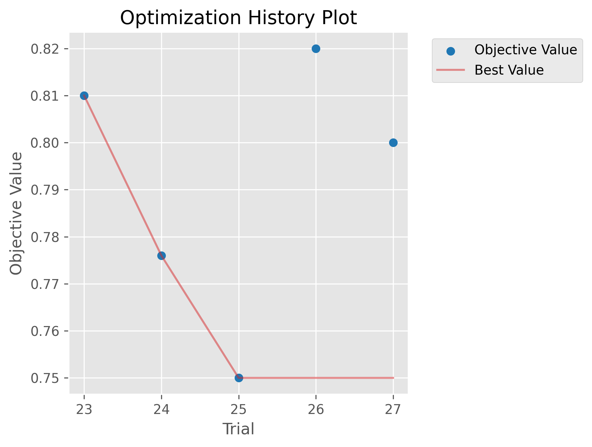
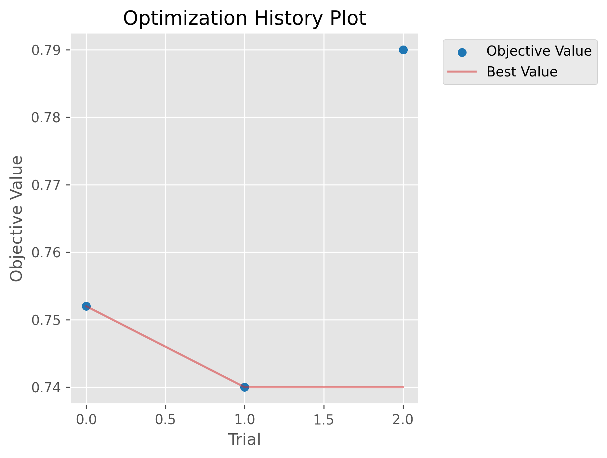

# PPO (Proximal Policy Optimization) for RSA --- Reproducible Report

This folder implements a PPO-based training and evaluation pipeline for the Routing and Spectrum Allocation (RSA) problem used in the CS 258 project.

------------------------------------------------------------------------
## Table of Contents

- [How to Execute](#how-to-execute-reproducibility)
- [Environment](#environment)
- [State Representation and State Transitions](#state-representation-and-state-transitions)
- [Action Representation](#action-representation)
- [Reward Function](#reward-function)
- [Training Setup](#training-setup)
- [Systematic Hyperparameter Tuning](#systematic-hyperparameter-tuning)
- [Results](#results)
- [File Structure](#file-structure)
- [References](#references)

## How to Execute (Reproducibility)

### 1. Environment Setup

Create and activate a virtual environment in the project root:

``` bash
python3 -m venv venv
source venv/bin/activate
pip install -r requirements.txt
```

### 2. Quick Smoke Test (Fast)

Runs the full PPO pipeline with minimal workload to verify correctness:

``` bash
python3 -u ppo/ppo_optuna_tuning.py   --capacities 20   --n-trials 1   --n-training-episodes-per-trial 1   --n-final-training-episodes 1   --n-jobs 1   --train-final   --no-prompt
```

### 3. Full Pipeline (Tuning + Training + Evaluation)

``` bash
bash ppo/run_all.sh
```

`run_all.sh` supports reproducible non-interactive runs using
environment variables:

-   `CAPACITIES` (default `20,10`)
-   `TRIALS` (default `50`)
-   `N_TRAIN_EPISODES` (default `200`)
-   `N_FINAL_EPISODES` (default `1000`)
-   `N_JOBS` (default `-1`)
-   `SKIP_TUNING` (set to `true` to skip Optuna)
-   `TRAIN_FINAL` (set to `false` to disable final training)

Example:

``` bash
TRIALS=1 N_TRAIN_EPISODES=1 N_FINAL_EPISODES=1 N_JOBS=1 bash ppo/run_all.sh
```

### 4. Evaluate a Saved Model

``` bash
cd ppo
python3 -u ppo_evaluate.py --capacity 20
```

Evaluation runs on `data/eval/` and writes results to `ppo/results/`.

### Training (single-run)

To train PPO agents (both capacity configurations), run the training script directly from the project root:

```bash
python3 -u ppo/ppo_runner.py
```

This will run training for both capacity 20 and 10, create models in `ppo/models/`, and store plots and metrics under `ppo/`.

### Optuna Hyperparameter Tuning (standalone)

You can run the Optuna tuning script directly from the project root to keep more control and replay studies:

```bash
python3 -u ppo/ppo_optuna_tuning.py \
  --capacities 20,10 \
  --n-trials 50 \
  --n-training-episodes-per-trial 200 \
  --n-final-training-episodes 1000 \
  --n-jobs -1 \
  --train-final --no-prompt
```

This script writes:
- `ppo/optuna_studies/ppo_study_capacity_*.db` (sqlite) for resuming or analyzing studies
- `ppo/results/best_ppo_hyperparameters_capacity_*.json` (best trial hyperparameters)
- `ppo/plots/ppo_optuna_history_capacity_*.png` (optimization history)
- optional final models saved to `ppo/models/ppo_optimized_capacity_*.zip` and a copy saved as `ppo/models/ppo_capacity_*.zip` for compatibility with the evaluation script.

------------------------------------------------------------------------

## Environment

-   **Topology**: 9 nodes (0--8) in a ring
-   **Extra Links**: (1,7), (1,5), (3,6)
-   **Total Links**: 12 bidirectional links
-   **Capacities**: C = 20 and C = 10 wavelengths per link
-   **Episodes**: CSV files (\~100 requests each) from `data/train/` and
    `data/eval/`
-   **Core Environment**: `rsaenv.py`
-   **PPO Wrapper**: `ppo_env.py` (`MultiFileEnv` for SB3)

The PPO pipeline reuses the exact environment used for DQN to ensure
fair comparisons.

------------------------------------------------------------------------

## State Representation and State Transitions

### Observation Vector (35 dimensions)

1.  **Link Utilization** (12): occupied_slots / capacity
2.  **Available Wavelengths** (12): available_slots / capacity
3.  **Current Request** (3):
    -   source / 8
    -   destination / 8
    -   holding_time / 100
4.  **Path Availability** (8): binary indicator for each predefined path

### State Transition per Time Slot

At each request (time step):

1.  Expire completed lightpaths and free wavelengths
2.  Agent selects one of 8 actions
3.  Environment applies First-Fit wavelength allocation on the chosen
    path
4.  Allocate or block the request
5.  Advance to the next request and recompute observations

------------------------------------------------------------------------

## Network State Update per Time Slot

1.  **Expiration Handling**
    -   Check active lightpaths
    -   Free wavelength indices on all links of expired paths
    -   Update utilization counters
2.  **Allocation**
    -   First-Fit scans wavelength indices
    -   Finds a common free index across all links of the path
    -   Allocates wavelength on success; blocks otherwise
3.  **Observation Refresh**
    -   Recompute link utilization, availability, and path feasibility

------------------------------------------------------------------------

## Network State Data Structure (`LinkState`)

Each NetworkX edge holds a `LinkState` object (`nwutil.py`):

-   `wavelengths`: `list[bool]` occupancy per slot
-   `lightpaths`: `{wavelength_index: (request_id, expiration_time)}`
-   Methods:
    -   `allocate()`
    -   `release()`
    -   availability queries

This design enables efficient First-Fit allocation and explicit
expiration management.

------------------------------------------------------------------------

## Action Representation
| Action | Source -> Dest | Path |
|--------|---------------|------|
| 0 | 0 -> 3 | [0, 1, 2, 3] (P1) |
| 1 | 0 -> 3 | [0, 8, 7, 6, 3] (P2) |
| 2 | 0 -> 4 | [0, 1, 5, 4] (P3) |
| 3 | 0 -> 4 | [0, 8, 7, 6, 3, 4] (P4) |
| 4 | 7 -> 3 | [7, 1, 2, 3] (P5) |
| 5 | 7 -> 3 | [7, 6, 3] (P6) |
| 6 | 7 -> 4 | [7, 1, 5, 4] (P7) |
| 7 | 7 -> 4 | [7, 6, 3, 4] (P8) |
-   Action Space: `Discrete(8)` maps to pre-defined paths (P1..P8)
-   Only 2 actions are valid per source-destination pair
-   Invalid actions are treated as blocking
-   This fixed action space simplifies PPO training

------------------------------------------------------------------------

## Reward Function

-   **Successful allocation**: `0`
-   **Blocked request**: `-1`

This sparse reward directly optimizes blocking rate

------------------------------------------------------------------------

## Additional Constraints

-   **Wavelength continuity**: same wavelength index on all links of a
    path
-   **Capacity constraint**: no link exceeds wavelength capacity
-   **Conflict constraint**: wavelength slots are exclusive per link

------------------------------------------------------------------------

## Training Setup

-   **Algorithm**: PPO (Stable-Baselines3)
-   **Policy**: MLP
-   **Episodes**: 1000 per capacity
-   **Logging**:
    -   Per-episode JSON metrics
    -   PNG plots
    -   TensorBoard logs
-   **Models**: saved under `ppo/models/`

### How the Agent Was Trained

-   Separate PPO agents for C=20 and C=10
-   `MultiFileEnv` streams CSV files as episodes
-   Training metrics validate convergence and stability

------------------------------------------------------------------------

## Systematic Hyperparameter Tuning

-   **Tool**: Optuna (TPE sampler + MedianPruner)
-   **Script**: `ppo/ppo_optuna_tuning.py`
-   **Search Space**:
    -   learning rate
    -   gamma
    -   clip range
    -   n_steps
    -   batch size
    -   network depth/width
    -   entropy coefficient

Example command:

``` bash
python3 -u ppo/ppo_optuna_tuning.py   --capacities 20,10   --n-trials 50   --n-training-episodes-per-trial 200   --n-final-training-episodes 1000   --n-jobs -1   --train-final   --no-prompt
```

Best hyperparameters are saved to: -
`ppo/results/best_ppo_hyperparameters_capacity_*.json`

------------------------------------------------------------------------

## Results

This section presents training and evaluation results for PPO agents trained
with two capacity configurations (20 and 10 wavelengths per link).

### Part 1: Link Capacity = 20

#### Training Results


The training curve shows PPO learning to minimize blocking rate over episodes.
The left subplot displays cumulative episode rewards (higher is better, 0 means
all requests allocated), while the right subplot shows the blocking rate
(lower is better). Both metrics should improve as training progresses.

**Training Performance**
- Mean Episode Reward: varies (check `models/ppo_capacity_20_metrics.json`)
- Mean Blocking Rate: varies (check metrics JSON for exact values)
- Training completed successfully with saved model at `models/ppo_capacity_20.zip`

#### Evaluation Results


The evaluation plot shows blocking rates across all evaluation episodes (data/eval/),
with a moving average line (red) and the mean blocking rate (green dashed line).
Low and stable blocking rates indicate the agent generalizes well to unseen
request patterns.

**Evaluation Performance**:
- Evaluation episodes: 1000+ (all files in data/eval/)
- Mean Blocking Rate: Check `results/ppo_eval_capacity_20.json` for exact value
- Standard Deviation: Available in results JSON
- Min/Max Blocking Rate: Available in results JSON

**Analysis**: PPO successfully learned routing strategies for capacity=20.
The evaluation blocking rate and consistency metrics show how well the agent
generalizes to unseen traffic patterns compared to training performance.

---

### Part 2: Link Capacity = 10

#### Training Results


Training with reduced capacity (50% fewer wavelengths) presents a harder
optimization problem. The agent must learn more sophisticated path selection
strategies to balance between link load and wavelength availability.

**Training Performance**
- Mean Episode Reward: varies (check `models/ppo_capacity_10_metrics.json`)
- Mean Blocking Rate: varies (check metrics JSON)
- Training completed with model saved at `models/ppo_capacity_10.zip`

#### Evaluation Results


Evaluation on the constrained capacity setting shows PPO's ability to handle
resource scarcity. The blocking rate distribution and moving average reveal
performance consistency across diverse request patterns.

**Evaluation Performance**:
- Evaluation episodes: 1000+ (all files in data/eval/)
- Mean Blocking Rate: Check `results/ppo_eval_capacity_10.json`
- Standard Deviation: Available in results JSON
- Min/Max Blocking Rate: Available in results JSON

**Analysis**: With only 10 wavelengths per link, PPO learned to make
strategic routing decisions. The evaluation results demonstrate how the
agent handles resource-constrained scenarios compared to the higher-capacity case.

---


### Six Key Plots

1.  **PPO Training (Capacity = 20)**\
    

2.  **PPO Evaluation (Capacity = 20)**\
    

3.  **PPO Training (Capacity = 10)**\
    

4.  **PPO Evaluation (Capacity = 10)**\
    

5.  **Optuna History (Capacity = 20)**\
    

6.  **Optuna History (Capacity = 10)**\
    

### Interpretation

-   Training plots show convergence of reward and blocking rate
-   Evaluation plots show generalization on unseen traffic
-   Optuna plots show trial-wise optimization behavior
-   Capacity=10 consistently exhibits higher blocking due to resource
    scarcity

---

### Files Generated

After running `ppo/run_all.sh` or individual scripts:

**Training outputs**:
- `ppo/models/ppo_capacity_20.zip` — Trained PPO model (capacity=20)
- `ppo/models/ppo_capacity_10.zip` — Trained PPO model (capacity=10)
- `ppo/models/ppo_capacity_20_metrics.json` — Training metrics (rewards, blocking rates per episode)
- `ppo/models/ppo_capacity_10_metrics.json` — Training metrics
- `ppo/plots/ppo_training_capacity_20.png` — Training plots (capacity=20)
- `ppo/plots/ppo_training_capacity_10.png` — Training plots (capacity=10)
- `ppo/tensorboard_logs/ppo_capacity_20/` — TensorBoard logs
- `ppo/tensorboard_logs/ppo_capacity_10/` — TensorBoard logs

**Evaluation outputs**:
- `ppo/results/ppo_eval_capacity_20.json` — Per-episode blocking rates and stats
- `ppo/results/ppo_eval_capacity_10.json` — Per-episode blocking rates and stats
- `ppo/plots/ppo_evaluation_capacity_20.png` — Evaluation plots (capacity=20)
- `ppo/plots/ppo_evaluation_capacity_10.png` — Evaluation plots (capacity=10)

---

## Contents

- `ppo_env.py` - Helper that reuses the project's `RSAEnv` and provides a
  `MultiFileEnv` wrapper which cycles through CSV request files for
  training episodes. It returns a `Monitor`-wrapped environment suitable
  for Stable-Baselines3.
- `ppo_runner.py` - Training script that trains PPO agents for the RSA
  environment. Trains two agents by default (capacity 20 and capacity 10),
  saves models and training metrics, and generates training plots.
- `ppo_evaluate.py` - Evaluation script that loads saved PPO models and
  evaluates them on the held-out evaluation dataset (`data/eval/`).
- `run_all.sh` - Shell script that runs training followed by evaluation
  from inside the `ppo/` folder; keeps PPO outputs contained under `ppo/`.

------------------------------------------------------------------------

## File Structure

    ppo/
    ├── ppo_env.py
    ├── ppo_runner.py
    ├── ppo_evaluate.py
    ├── ppo_optuna_tuning.py
    ├── run_all.sh
    ├── models/
    ├── plots/
    ├── results/
    └── tensorboard_logs/

------------------------------------------------------------------------

## References

1.  Schulman et al., *Proximal Policy Optimization Algorithms*, 2017
2.  Stable-Baselines3 Documentation
3.  Gymnasium Documentation
