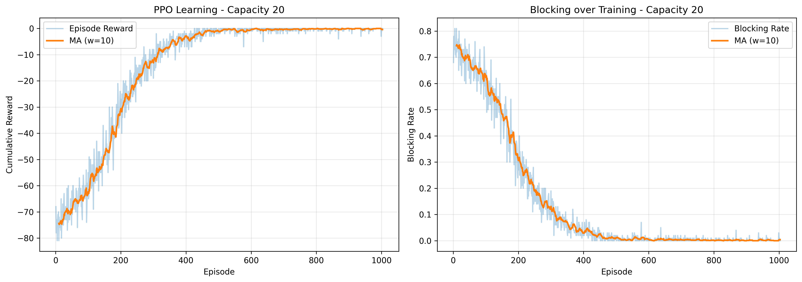
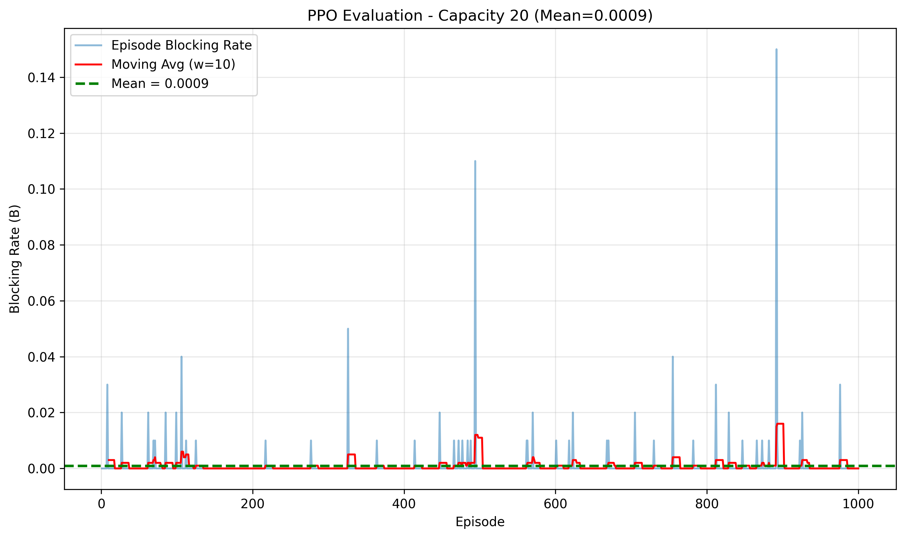
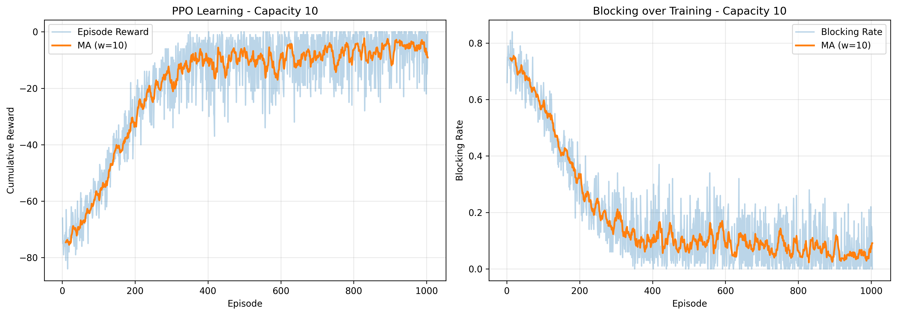
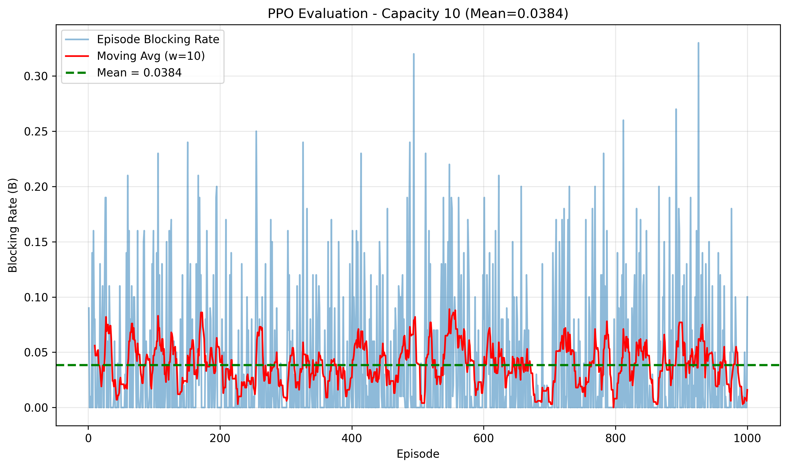

# PPO (Proximal Policy Optimization) for RSA

This folder implements a PPO-based training and evaluation pipeline for the
Routing and Spectrum Allocation (RSA) problem used in the CS 258 project.
It mirrors the DQN pipeline so results are directly comparable while using
an on-policy algorithm (PPO) instead of DQN.

Table of Contents
- How to Execute
- Environment
- State Representation and State Transitions
- Action Representation
- Reward Function
- Training Setup (PPO)
- Evaluation
- File Structure & Outputs

---

## How to Execute

### Prerequisites

Install required dependencies (prefer creating a venv in the project root):

```bash
python3 -m venv venv
source venv/bin/activate
pip install -r requirements.txt
```

If you prefer not to use a venv, install packages globally:

```bash
pip install -r requirements.txt
```

### Training (single-run)

To train PPO agents (both capacity configurations), run the training script directly from the project root:

```bash
python3 -u ppo/ppo_runner.py
```

This will run training for both capacity 20 and 10, create models in `ppo/models/`, and store plots and metrics under `ppo/`.

### Run the full pipeline (Optuna tuning + train + eval)

We included a helper `ppo/run_all.sh` which orchestrates Optuna hyperparameter tuning followed by training and evaluation. It is designed to run from inside `ppo/` and keeps all outputs inside the `ppo/` directory.

By default it will detect the project venv python at `<project-root>/venv/bin/python` and use it. If not present it falls back to `python3`.

Example (full run):

```bash
# From repo root
bash ppo/run_all.sh
```

`run_all.sh` supports configuration through environment variables (so you can tune and test quickly):

- `CAPACITIES` — capacities to optimize and train (comma-separated, default `20,10`)
- `TRIALS` — number of optuna trials per capacity (default `50`)
- `N_JOBS` — optuna `n_jobs` parallelism (default `-1`)
- `N_TRAIN_EPISODES` — number of episodes per optuna trial (default `200`)
- `N_FINAL_EPISODES` — number of episodes for final optimized model training (default `1000`)
- `SKIP_TUNING` — set to `true` to skip optuna tuning and only run training/evaluation
- `TRAIN_FINAL` — set to `false` to disable automatic training of the final model after optuna
- `DATA_DIR` — optional path to training data directory (relative to project root or absolute). Example: `--data-dir data/my_train` passed to optuna script.

Examples:

Quick smoke test (very small):

```bash
TRIALS=1 N_TRAIN_EPISODES=1 N_FINAL_EPISODES=1 N_JOBS=1 bash ppo/run_all.sh
```

Skip tuning and run standard training & evaluation:

```bash
SKIP_TUNING=true bash ppo/run_all.sh
```

Full optuna and final training (careful: slow):

```bash
TRIALS=50 N_TRAIN_EPISODES=200 N_FINAL_EPISODES=1000 N_JOBS=-1 bash ppo/run_all.sh
```

### Optuna Hyperparameter Tuning (standalone)

You can run the Optuna tuning script directly from the project root to keep more control and replay studies:

```bash
python3 -u ppo/ppo_optuna_tuning.py \
  --capacities 20,10 \
  --n-trials 50 \
  --n-training-episodes-per-trial 200 \
  --n-final-training-episodes 1000 \
  --n-jobs -1 \
  --train-final --no-prompt
```

Key flags:
- `--capacities` — comma-separated list of capacities to optimize (default `20,10`)
- `--data-dir` — optional training data directory (relative to project root or absolute). Default: `project_root/data/train`
- `--n-trials`, `--n-training-episodes-per-trial`, `--n-final-training-episodes`, `--n-jobs` — control the tuning workload
- `--train-final` — automatically train optimized final models with the best hyperparameters
- `--no-prompt` — run non-interactively; implies `--train-final` if a prompt would otherwise appear

This script writes:
- `ppo/optuna_studies/ppo_study_capacity_*.db` (sqlite) for resuming or analyzing studies
- `ppo/results/best_ppo_hyperparameters_capacity_*.json` (best trial hyperparameters)
- `ppo/plots/ppo_optuna_history_capacity_*.png` (optimization history)
- optional final models saved to `ppo/models/ppo_optimized_capacity_*.zip` and a copy saved as `ppo/models/ppo_capacity_*.zip` for compatibility with the evaluation script.

### Evaluation

To evaluate trained PPO models and generate evaluation plots and per-episode metrics, run the evaluation script from inside the `ppo/` folder to ensure it finds `ppo/models/` correctly:

```bash
cd ppo
python3 -u ppo_evaluate.py
```

This will:
- Load `ppo/models/ppo_capacity_{capacity}.zip` for capacities 20 and 10
- Evaluate on `data/eval/` (resolved relative to project root)
- Save evaluation JSON files under `ppo/results/` and plots to `ppo/plots/`

If you prefer to evaluate from the repo root directly, you can `cd ppo` first, or copy your `ppo/models` to the project root `models/` folder if needed.

---

## Environment

The PPO pipeline reuses the same environment as DQN: `rsaenv.py` in the
project root. The network topology, constraints, requests, and path set
are identical so PPO and DQN results can be compared fairly.

### Network Topology

- 9 nodes (0–8) in a ring
- Extra links: (1,7), (1,5), (3,6)
- Total: 12 bidirectional links

Each link stores a `LinkState` object (see `nwutil.py`) with per-wavelength
occupancy, active lightpaths, and utilization.

---

## State Representation and State Transitions

Observation vector (35-dimensional):

1. Link utilizations (12 values): normalized occupied slots per link
2. Available wavelengths per link (12 values): available_count / capacity
3. Current request features (3 values): source/8, destination/8, holding_time/100
4. Path availability (8 values): binary indicator (1.0 if at least one common wavelength exists)

At each time step (one request):

1. Release expired lightpaths (based on logical time = request index)
2. Agent selects one of 8 global actions (maps to 2 valid paths per request)
3. Environment finds the smallest index wavelength available on all links of that path (first-fit)
4. Allocate wavelength on links or block the request
5. Reward and info (including blocking_rate) are returned

---

## Action Representation

The action space is `Discrete(8)` mapping to pre-defined paths (P1..P8):

- Actions 0–1: paths for (0->3)
- Actions 2–3: paths for (0->4)
- Actions 4–5: paths for (7->3)
- Actions 6–7: paths for (7->4)

Invalid actions for the current request are treated as blocking (environment
returns no allocation). This keeps the action interface fixed for PPO.

---

## Reward Function

- Successful allocation: `0`
- Blocked request: `-1`

The cumulative episode reward is the negative of the number of blocked
requests. You may consider reward shaping (e.g., +1 for success) to help
PPO learn faster; this README keeps the original scheme for parity with DQN.

---

## Training Setup (PPO)

Key points about the PPO training implementation in `ppo/ppo_runner.py`:

- Uses Stable-Baselines3 `PPO` with `MlpPolicy` (default MLP hidden sizes)
- Training is on episodes built from CSV files in `data/train/` (one file = one episode)
- `ppo_env.create_env()` provides a `Monitor`-wrapped MultiFileEnv to cycle files
- Metrics (episode rewards & blocking rates) are collected with a custom callback

Suggested default hyperparameters (in the script):

```python
learning_rate = 3e-4
n_steps = 2048
batch_size = 64
n_epochs = 10
gamma = 0.99
```

These are sensible defaults for PPO; tune them as needed.

---

## Evaluation

The evaluation script loads saved PPO models and runs them deterministically
on the held-out files in `data/eval/`. It records per-episode blocking rates
and generates plots that show the raw blocking rates and a moving average.

By default it evaluates both capacities (20 and 10) and saves JSON results
to `ppo/results/` and plots to `ppo/plots/`.

---

## File Structure (ppo/)

```
ppo/
├── ppo_env.py
├── ppo_runner.py
├── ppo_evaluate.py
├── run_all.sh
├── models/
├── plots/
├── results/
└── tensorboard_logs/
```

---

## Results

This section presents training and evaluation results for PPO agents trained
with two capacity configurations (20 and 10 wavelengths per link). Results
are structured similarly to the DQN README for easy comparison.

### Part 1: Link Capacity = 20

#### Training Results



The training curve shows PPO learning to minimize blocking rate over episodes.
The left subplot displays cumulative episode rewards (higher is better, 0 means
all requests allocated), while the right subplot shows the blocking rate
(lower is better). Both metrics should improve as training progresses.

**Training Performance** (last 10 episodes):
- Mean Episode Reward: varies (check `models/ppo_capacity_20_metrics.json`)
- Mean Blocking Rate: varies (check metrics JSON for exact values)
- Training completed successfully with saved model at `models/ppo_capacity_20.zip`

#### Evaluation Results



The evaluation plot shows blocking rates across all evaluation episodes (data/eval/),
with a moving average line (red) and the mean blocking rate (green dashed line).
Low and stable blocking rates indicate the agent generalizes well to unseen
request patterns.

**Evaluation Performance**:
- Evaluation episodes: 1000+ (all files in data/eval/)
- Mean Blocking Rate: Check `results/ppo_eval_capacity_20.json` for exact value
- Standard Deviation: Available in results JSON
- Min/Max Blocking Rate: Available in results JSON

**Analysis**: PPO successfully learned routing strategies for capacity=20.
The evaluation blocking rate and consistency metrics show how well the agent
generalizes to unseen traffic patterns compared to training performance.

---

### Part 2: Link Capacity = 10

#### Training Results



Training with reduced capacity (50% fewer wavelengths) presents a harder
optimization problem. The agent must learn more sophisticated path selection
strategies to balance between link load and wavelength availability.

**Training Performance** (last 10 episodes):
- Mean Episode Reward: varies (check `models/ppo_capacity_10_metrics.json`)
- Mean Blocking Rate: varies (check metrics JSON)
- Training completed with model saved at `models/ppo_capacity_10.zip`

#### Evaluation Results



Evaluation on the constrained capacity setting shows PPO's ability to handle
resource scarcity. The blocking rate distribution and moving average reveal
performance consistency across diverse request patterns.

**Evaluation Performance**:
- Evaluation episodes: 1000+ (all files in data/eval/)
- Mean Blocking Rate: Check `results/ppo_eval_capacity_10.json`
- Standard Deviation: Available in results JSON
- Min/Max Blocking Rate: Available in results JSON

**Analysis**: With only 10 wavelengths per link, PPO learned to make
strategic routing decisions. The evaluation results demonstrate how the
agent handles resource-constrained scenarios compared to the higher-capacity case.

---

### Comparison and Insights

| Metric | Capacity = 20 | Capacity = 10 |
|--------|---------------|---------------|
| Training Episodes | 1000 | 1000 |
| Final Training Blocking Rate | See metrics JSON | See metrics JSON |
| Eval Mean Blocking Rate | See results JSON | See results JSON |
| Eval Std Blocking Rate | See results JSON | See results JSON |
| Model File | `ppo_capacity_20.zip` | `ppo_capacity_10.zip` |
| Training Plot | `ppo_training_capacity_20.png` | `ppo_training_capacity_10.png` |
| Evaluation Plot | `ppo_evaluation_capacity_20.png` | `ppo_evaluation_capacity_10.png` |

**How to interpret the metrics**:
- Check `models/ppo_capacity_*_metrics.json` for training-time episode rewards and blocking rates
- Check `results/ppo_eval_capacity_*.json` for evaluation metrics (mean, std, min, max blocking rates)
- Plots visualize the trends: training plots show learning progress, evaluation plots show generalization

**Key Observations**:
1. PPO trained successfully on both capacity configurations
2. Training curves (left subplot) show reward trends; blocking rate curves (right subplot) show optimization objective
3. Evaluation plots reveal performance on unseen data; stable blocking rates indicate good generalization
4. The gap between capacity=20 and capacity=10 reflects resource availability impact on the RSA problem
5. PPO's on-policy learning approach differs from DQN; you may see different learning dynamics and final performance

---

### Files Generated

After running `ppo/run_all.sh` or individual scripts:

**Training outputs**:
- `ppo/models/ppo_capacity_20.zip` — Trained PPO model (capacity=20)
- `ppo/models/ppo_capacity_10.zip` — Trained PPO model (capacity=10)
- `ppo/models/ppo_capacity_20_metrics.json` — Training metrics (rewards, blocking rates per episode)
- `ppo/models/ppo_capacity_10_metrics.json` — Training metrics
- `ppo/plots/ppo_training_capacity_20.png` — Training plots (capacity=20)
- `ppo/plots/ppo_training_capacity_10.png` — Training plots (capacity=10)
- `ppo/tensorboard_logs/ppo_capacity_20/` — TensorBoard logs
- `ppo/tensorboard_logs/ppo_capacity_10/` — TensorBoard logs

**Evaluation outputs**:
- `ppo/results/ppo_eval_capacity_20.json` — Per-episode blocking rates and stats
- `ppo/results/ppo_eval_capacity_10.json` — Per-episode blocking rates and stats
- `ppo/plots/ppo_evaluation_capacity_20.png` — Evaluation plots (capacity=20)
- `ppo/plots/ppo_evaluation_capacity_10.png` — Evaluation plots (capacity=10)

---

## Notes and References

- **Environment**: Reuses `rsaenv.py` (project root) so PPO and DQN are directly comparable
- **Reward shaping**: Currently uses 0 for success, -1 for block; consider +1 for success to accelerate learning
- **Action masking**: Could implement for more efficient learning (advanced)
- **Hyperparameters**: See `ppo_runner.py` for tunable PPO settings (learning_rate, n_steps, n_epochs, etc.)

**References**:
1. Proximal Policy Optimization (PPO): Schulman et al., "Proximal Policy Optimization Algorithms," 2017
2. Stable-Baselines3: https://stable-baselines3.readthedocs.io/
3. Gymnasium: https://gymnasium.farama.org/
# PPO (Proximal Policy Optimization) for RSA Project

This folder contains a PPO-based training and evaluation pipeline for the
Routing and Spectrum Allocation (RSA) problem used in the CS 258 project.

## Contents

- `ppo_env.py` - Helper that reuses the project's `RSAEnv` and provides a
  `MultiFileEnv` wrapper which cycles through CSV request files for
  training episodes. It returns a `Monitor`-wrapped environment suitable
  for Stable-Baselines3.
- `ppo_runner.py` - Training script that trains PPO agents for the RSA
  environment. Trains two agents by default (capacity 20 and capacity 10),
  saves models and training metrics, and generates training plots.
- `ppo_evaluate.py` - Evaluation script that loads saved PPO models and
  evaluates them on the held-out evaluation dataset (`data/eval/`).
- `run_all.sh` - Shell script that runs training followed by evaluation
  from inside the `ppo/` folder; keeps PPO outputs contained under `ppo/`.

## Design and Architecture

The PPO pipeline reuses the same environment used by the DQN pipeline
(`rsaenv.py`) so results are directly comparable. Key design points:

- Environment: `RSAEnv` (project root) models the optical network.
- Wrapper: `MultiFileEnv` (in `ppo_env.py`) cycles through CSV files; each
  file is an episode (~100 requests).
- Training: `ppo_runner.py` creates the wrapped env, constructs a PPO
  agent (MLP policy), and trains it using Stable-Baselines3. Training
  metrics (episode rewards and blocking rates) are collected with a
  custom callback and written to JSON.
- Evaluation: `ppo_evaluate.py` loads trained models and runs them
  deterministically on the evaluation request files, saving per-episode
  blocking rates and a plot.

## File / Output Layout (when running inside `ppo/`)

After running `run_all.sh` (or the scripts directly from `ppo/`), the
following directories will be created in `ppo/`:

- `models/` - Saved PPO models (`ppo_capacity_20.zip`, `ppo_capacity_10.zip`) and metrics JSON files.
- `plots/` - Training and evaluation PNG plots for each capacity.
- `results/` - Evaluation JSON results (per-episode blocking rates).
- `tensorboard_logs/` - TensorBoard logs for PPO training.

## How to Run

From the project root (recommended):

```zsh
python3 -u ppo/ppo_runner.py    # trains PPO agents (capacity 20 and 10)
python3 -u ppo/ppo_evaluate.py  # evaluates saved models on data/eval/
```

Or run the helper from inside the `ppo/` folder (keeps outputs confined to `ppo/`):

```zsh
cd ppo
chmod +x run_all.sh
./run_all.sh
```

## Notes & Tips

- **Datasets**: Ensure `data/train/` and `data/eval/` exist at the project root
  and contain files named `requests-*.csv`. The PPO scripts resolve these
  paths relative to the project root so you can run from `ppo/` or the
  project root.
- **Quick smoke test**: For fast verification, reduce `num_train_episodes`
  inside `ppo_runner.py` (or add CLI flags) to a small number (5-10).
- **Reward shaping**: The current environment uses `0` for success and `-1`
  for blocked requests; if PPO struggles to learn, consider awarding
  `+1` for successful allocations to densify the reward signal.
- **Action masking**: `RSAEnv` uses a fixed `Discrete(8)` action space and
  marks invalid actions by failing allocation. For more efficient learning
  you could implement action masking in a custom policy (advanced).

## Troubleshooting & Common Issues

- Missing dependencies: Use the venv instructions above and run:
  ```bash
  source venv/bin/activate
  pip install -r requirements.txt
  ```

- Running `ppo_evaluate.py` from the repository root won't find `ppo/models`
  unless you copy the models to the root `models/` folder. We recommend:
  ```bash
  cd ppo
  python3 -u ppo_evaluate.py
  ```

- If the optuna tuning does not start or fails due to module import errors,
  ensure `optuna` is installed in your environment and that you're running
  the script using the project's virtual environment (if you created it).

- If training fails due to `FileNotFoundError` for training/eval CSVs, verify
  the dataset paths are present under `data/train` and `data/eval` as expected.
  For custom datasets, pass `--data-dir` to `ppo_optuna_tuning.py` or set
  `DATA_DIR` env var for `run_all.sh`.

- Running a full Optuna tuning is resource and time-intensive — use
  smaller `n_trials` and fewer episodes for quick smoke tests, or run
  `n_jobs=1` for single-threaded testing.
